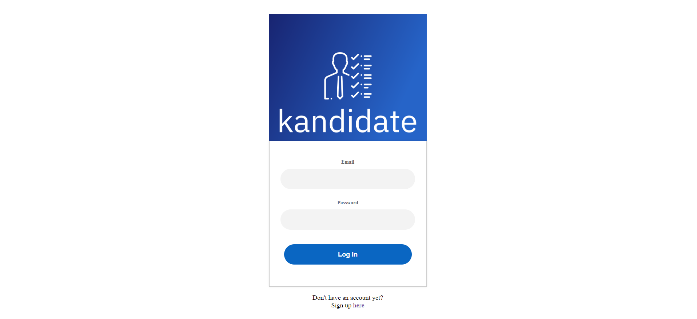
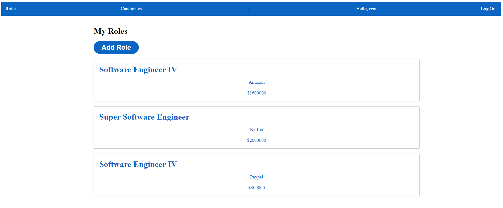

# Kandidate
A candidate tracking app for recruiters and HR professionals. Simplify your hiring process by having a single place to save potential candidates for the roles you're looking to fill.
_________________________________________________________________
## Technologies used:

* MongoDB

* Express.js

* React.js

* Node.js

* CSS 

## Getting Started:
Navigate to the deployed app following the link below. Create an account, log in, and enjoy:

* https://kandidate.onrender.com/
_________________________________________________________________

## Screenshots:

This is what the app looks like:
### Login screen

### Index Page

### Detail Page

### Update Page

### Add Page

### ERD

## V2 User Stories
* AAU, I want to be able to add notes to a candidate profile.
* AAU, I want to be able to see upload a candidate's resume to their profile.

_________________________________________________________________
## V3 User Stories
* AAU, I want candidates to be create accounts and add their own profiles to my list.
* AAU, I want to log in using my Linkedin credentials
_________________________________________________________________

